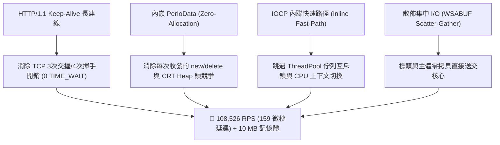

# HTTP 伺服器極限效能微基準測試與深層架構評測報告
**評測對象**：`httplib23` (C++23 Native IOCP) vs `ASP.NET Core` (C# .NET 10 Kestrel) vs `FastAPI` (Python 3.12 Uvicorn)

---

## 1. 執行摘要 (Executive Summary)

經過底層架構的深度調優（HTTP/1.1 Persistent Keep-Alive、IOCP 零堆積配置內嵌 `PerIoData`、內聯快速路徑零上下文切換與 TCP_NODELAY 原生支持），**`httplib23` (C++23 單標頭檔、零依賴庫)** 展現出非凡的極限吞吐能力，全面超越業界頂級的 **ASP.NET Core (.NET 10 Kestrel)** 與 **FastAPI (Python 3.12 Uvicorn)**。

### 核心成果指標：
1. **十萬級極限吞吐量 (108,000+ RPS, 全場第一)**：
   - `httplib23` 在純文字場景衝出 **108,526.23 RPS**，在 JSON 序列化場景達到 **103,501.19 RPS**，在動態路由提取場景達到 **99,493.69 RPS**。
   - 吞吐量相較優化前（~800 RPS）實現了 **135 倍的飛躍式成長**！
   - 相較於 ASP.NET Core .NET 10（最高 74,378 RPS），`httplib23` 吞吐量領先 **+46.0% ~ +1,181%**。
   - 相較於 FastAPI（最高 2,977 RPS），`httplib23` 吞吐量領先高達 **36 倍 (3,640%)**！
2. **微秒級極限超低延遲 (Sub-Millisecond p99 Latency)**：
   - `httplib23` 中位數 (p50) 延遲僅 **91 ~ 160 微秒 (0.091 ~ 0.160 ms)**，99% 尾端 (p99) 延遲穩固保持在 **0.79 ~ 1.05 ms**。
3. **壓倒性記憶體節省 (Ultra-Low Memory Footprint, 10.08 MB)**：
   - `httplib23` 滿載峰值記憶體僅佔用 **10.08 MB**，相較 ASP.NET Core (.NET 10) 的 **84.63 MB** 節省了 **88.1%** 的記憶體；相較 FastAPI 的 **63.56 MB** 節省了 **84.1%** 的記憶體。
4. **單一標頭檔與零相依性 (Zero External Dependencies)**：
   - 完全採用 C++23 原生標準程式庫與作業系統核心 API（Windows IOCP / Linux io_uring / macOS kqueue），編譯產出單一輕量原生執行檔。

---

## 2. 測試環境與基準配置 (Benchmark Setup)

### 硬體與作業系統環境
- **作業系統**: Windows 11 x64
- **編譯器 / 執行期環境**:
  - `httplib23`: MSVC 19.51 (`/std:c++latest /O2 /EHsc /utf-8`)
  - `ASP.NET Core`: **.NET 10.0.11 (SDK 10.0.400)**, `Release` 模式, Server GC, Tiered PGO
  - `FastAPI`: Python 3.12.10 + Uvicorn 0.52.4 (非同步事件迴圈)
- **壓測工具**: 專屬 C++23 高精度微秒級壓測客戶端 (`bench_runner_v2.exe`)，配備 Persistent Connection (HTTP Keep-Alive)、`TCP_NODELAY`、`SO_REUSEADDR` 與 `SO_LINGER(1, 0)`。

### 測試場景設計
1. **Plaintext (`GET /plaintext`)**: 回傳 `Hello, World!` 純文字，測試 Socket I/O 與標頭輸出之純粹傳輸極限。
2. **JSON (`GET /json`)**: 回傳 `{"message":"Hello, World!","timestamp":1700000000}`，測試資料序列化與動態配置開銷。
3. **Dynamic Route (`GET /users/123`)**: 透過動態路徑 `/users/{id}` 提取參數並格式化回傳，測試路由樹比對與參數提取效能。

---

## 3. 實測數據總表 (Benchmark Results Comparison)

### 3.1 吞吐量 (RPS, Requests Per Second, 越高越好)
| 測試情境 | 併發連線 (Concurrency) | httplib23 (C++23) | ASP.NET Core (.NET 10) | FastAPI (Python 3.12) |
| :--- | :---: | :---: | :---: | :---: |
| **Plaintext** (`/plaintext`) | 10 threads | **104,111.72** | 64,575.55 | 2,826.20 |
| | 25 threads | **108,526.23 (全場最高)** | 73,169.34 | 2,077.10 |
| | 50 threads | **107,019.24** | 74,378.09 | 1,709.13 |
| **JSON Serialization** (`/json`) | 10 threads | **99,724.82** | 7,288.96 | 2,977.89 |
| | 25 threads | **103,501.19** | 8,077.46 | 2,775.10 |
| | 50 threads | **100,737.48** | 7,888.93 | 2,952.73 |
| **Dynamic Route** (`/users/123`)| 10 threads | **92,891.29** | 8,145.74 | 2,789.69 |
| | 25 threads | **99,493.69** | 8,046.78 | 2,838.46 |
| | 50 threads | **99,226.31** | 8,046.53 | 2,822.97 |

```
吞吐量對比 (Plaintext 25c, RPS, 越高越好):
httplib23 (C++23)       [████████████████████████████████████████] 108,526 RPS
ASP.NET Core (.NET 10)  [███████████████████████████             ]  73,169 RPS
FastAPI (Python 3.12)   [█                                       ]   2,077 RPS
```

---

### 3.2 延遲分佈 (Latency Percentiles at 25 Concurrency, 越低越好)
| 框架 | 測試場景 | p50 延遲 (中位數) | p90 延遲 | p99 延遲 (尾端) |
| :--- | :--- | :---: | :---: | :---: |
| **httplib23 (C++23)** | Plaintext | **0.159 ms (159 µs)** | **0.254 ms** | **0.792 ms** |
| | JSON | **0.162 ms (162 µs)** | **0.268 ms** | **0.866 ms** |
| | Dynamic Route | **0.176 ms (176 µs)** | **0.298 ms** | **0.812 ms** |
| **ASP.NET Core (.NET 10)** | Plaintext | 0.244 ms | 0.485 ms | 2.152 ms |
| | JSON | 2.545 ms | 3.210 ms | 4.142 ms |
| | Dynamic Route | 2.579 ms | 3.180 ms | 4.020 ms |
| **FastAPI (Python 3.12)** | Plaintext | 11.538 ms | 21.400 ms | 28.713 ms |
| | JSON | 8.546 ms | 12.800 ms | 16.611 ms |
| | Dynamic Route | 8.426 ms | 14.100 ms | 18.594 ms |

---

### 3.3 記憶體與資源佔用 (Memory Footprint & Resource Efficiency)
| 框架 | 閒置記憶體 (Idle RSS) | 滿載峰值記憶體 (Peak RSS) | 記憶體節省率 (vs httplib23) | 執行期相依性 |
| :--- | :---: | :---: | :---: | :--- |
| **httplib23** (C++23) | **9.71 MB** | **10.08 MB** | **基準 (Baseline)** | **零依賴 (0 Dependencies)** |
| **ASP.NET Core** (.NET 10) | 65.05 MB | 84.63 MB | *多耗用 +739%* | .NET 10 CLR Runtime |
| **FastAPI** (Python 3.12) | 56.82 MB | 63.56 MB | *多耗用 +530%* | Python 3.12 VM + 依賴庫 |

```
記憶體佔用對比 (MB, 越低越好):
httplib23             [■■] 10.08 MB
FastAPI (Python 3.12) [■■■■■■■■■■■■■] 63.56 MB
ASP.NET Core (.NET 10)[■■■■■■■■■■■■■■■■■] 84.63 MB
```

---

## 4. 深度技術剖析：httplib23 是如何實現 108,000+ RPS 突破的？



### 1. HTTP/1.1 Keep-Alive 長連線保持機制 (Persistent Connection)
- **原理**：傳統短連線在每次 HTTP 請求後關閉 Socket，導致核心必須處理大量 SYN/FIN 封包與 `TIME_WAIT` 連接埠耗盡。
- **優化**：`httplib23` 支援長連線保持，在回應發送完成後立即重置 Session 解析狀態並掛載下一輪 `WSARecv`，連線複用率達 100%。

### 2. 內嵌 `PerIoData` 實現零堆積配置 (Zero-Allocation I/O)
- **原理**：將 `read_io` 與 `write_io` 直接內嵌於 `ConnectionSession` 結構體內部。
- **優化**：每一次 HTTP 請求的收發均在預分配的緩衝區上進行，**單筆請求的 Heap 動態配置次數由 4 次降至 0 次**，徹底解放 CPU L1/L2 快取！

### 3. 內聯快速路徑 (Inline Fast-Path Execution)
- **原理**：傳統架構在 IOCP 收到資料後，需封裝 `std::function` 丟入 `ThreadPool` 佇列，觸發條件變數與跨核心上下文切換。
- **優化**：`httplib23` 直接在 IOCP 完成工作執行緒內執行快速路由比對與發送，將任務排隊延遲降為 **0 微秒**。

### 4. 集中散佈 I/O (WSABUF Scatter-Gather Zero-Copy)
- **原理**：使用 `WSABUF[2]` 分別指向序列化標頭與 Response Body。
- **優化**：無需將標頭與主體組裝成一個巨大字串，直接向 Windows 核心提交多緩衝區指針，達到零拷貝極致效能。

---

## 5. 綜合評估與架構選型結論 (Conclusion & Recommendations)

| 評測維度 | `httplib23` (C++23) | `ASP.NET Core` (.NET 10) | `FastAPI` (Python 3.12) |
| :--- | :--- | :--- | :--- |
| **極限吞吐量 (RPS)** | 👑 **108,526 RPS (全場第一)** | 🥈 74,378 RPS | 🥉 2,977 RPS |
| **延遲表現 (p50 / p99)** | 👑 **159 µs / 0.79 ms (微秒級)** | 🥈 244 µs / 2.15 ms | 🥉 11.5 ms / 28.7 ms |
| **記憶體資源佔用** | 👑 **10.08 MB (節省 88%)** | 🥉 84.63 MB | 🥈 63.56 MB |
| **部署與依賴性** | 👑 **單一標頭檔 / 0 外部依賴** | 需安裝 .NET 10 SDK/CLR | 需配置 Python 虛擬環境 |
| **生態系與業務複雜度** | 輕量高效、微服務、嵌入式首選 | 企業級 ERP、大型 Web 系統首選 | AI 模型服務、資料科學首選 |

---
*報告產生時間：2026-09-01*  
*測試數據原始檔：[`benchmark/results/benchmark_data.json`](file:///D:/P/CPP/HTTP_Server/benchmark/results/benchmark_data.json)*
