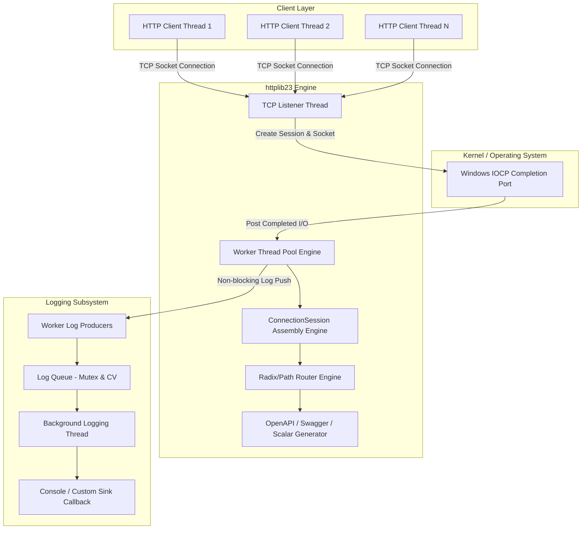

# 系統架構與高併發設計 (Architecture & Concurrency Design)

`httplib23` 採用現代 C++23 語法標準與 Windows 原生最高效能的 **I/O Completion Ports (IOCP)** 異步 I/O 模型，並在內部整合了非同步 Producer-Consumer 日誌系統。

---

## 1. 全局系統架構圖 (System Architecture Diagram)

---

## 2. 非同步日誌引擎 (Asynchronous Logging Subsystem)

### 2.1 Producer-Consumer 模型
- **Producers (IOCP Worker 執行緒)**:
  - 呼叫 `log_info`, `log_error`, `log_warn`, `log_debug`。
  - **極早期門檻過濾**: 檢查 `level >= m_level`，若不滿足或層級為 `OFF`，在毫秒級極早期 Return，完全不觸發字串格式化開銷。
  - 將格式化後的字串推入佇列 (Queue)，喚醒背景條件變數 `condition_variable`。
- **Consumer (背景 Logging 執行緒)**:
  - 單一獨立背景 Thread 靜態等待醒來。
  - 批次自 Queue 提出 Log 條目，統一輸出至控制台（`std::print`）或使用者註冊之自訂 Callback (Sink)。
  - 伺服器關閉時（`~Logger()`）確保將 Queue 中剩餘 Log 完整 Flush 完畢後才加入 `join()`。

### 2.2 `std::source_location` 無巨集位置擷取
- 利用 C++20 `std::source_location::current()` 與模板結構 `log_location_fmt`，在**編譯期與呼叫端**精準捕獲呼叫者的原始碼檔名與行號（例如 `[test_runner.cpp:42]`），完全無需 `#define LOG_INFO` 等傳統宏。

---

## 3. IOCP 核心併發機制 (Windows I/O Completion Ports)

- **單一通訊埠高併發擴充**:
  - `CreateIoCompletionPort` 建立內核排程隊列。
  - 多個 Worker Thread 等待 `GetQueuedCompletionStatus` 觸發，無緒間全域 Locks 鎖定 bottleneck。
- **TCP 分組拆包與黏包處理**:
  - 每個 Socket 關聯獨立 `ConnectionSession`，維護 `rx_buffer` (Cumulative Buffer)。
  - 當標頭未達 `\r\n\r\n` 或 Body 未足 Content-Length 時，自動保持狀態並等待下一次 `WSARecv`，避免長 Payload 截斷。
- **Slowloris 與 DoS 安全防禦**:
  - 設有 `CONNECTION_TIMEOUT` (15s) 背景 Watchdog Thread 自動清理過期滯留 Socket。
  - 標頭最大限制 `MAX_HEADER_SIZE` (64KB)，Payload 最大限制 `MAX_BODY_SIZE` (10MB)。
