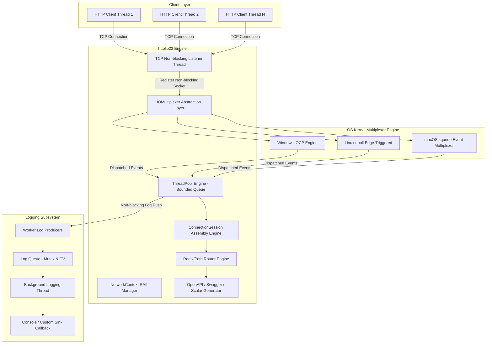

# 跨平台系統架構與高併發設計 (Cross-Platform Architecture & Concurrency Design)

`httplib23` 採用現代 C++23 語法標準與 **零外部相依 (Zero Dependencies)** 原則，針對 Windows、Linux 與 macOS 平台提供基於 OS 內核最高效能的多路復用 (I/O Multiplexing) 架構。

---

## 1. 全局系統架構圖 (Cross-Platform System Architecture Diagram)

---

## 2. 跨平台多路復用抽象層 (Platform Abstraction & IOMultiplexer)

`httplib23` 透過條件編譯與介面抽象化達成跨平台相容：

### 2.1 平台 Socket 抽象層 (Platform Abstraction Layer)
- 統一型態別名 `socket_t` (`SOCKET` on Windows, `int` on POSIX)。
- 統一無效通訊埠標誌 `invalid_socket` (`INVALID_SOCKET` on Windows, `-1` on POSIX)。
- 統一錯誤取得 `get_last_socket_error()` (`WSAGetLastError()` on Windows, `errno` on POSIX)。
- 統一非阻塞模式設定 `set_nonblocking(socket_t s)` (`ioctlsocket(s, FIONBIO, &mode)` on Windows, `fcntl(s, F_SETFL, flags | O_NONBLOCK)` on POSIX)。

### 2.2 平台多路復用引擎實作 (Platform Engines)
- **🪟 Windows (IOCP)**:
  - 呼叫 `CreateIoCompletionPort` 建立 completion port。
  - 使用 `WSARecv` 與 `WSASend` 搭配 `OVERLAPPED` 進行非同步讀寫。
- **🐧 Linux (epoll)**:
  - 封裝 `EpollMultiplexer`，呼叫 `epoll_create1(0)`。
  - 使用 `EPOLLIN | EPOLLET` (Edge-Triggered 邊緣觸發模式) 與非阻塞 `recv` 讀取至 `EAGAIN`/`EWOULDBLOCK`。
- **🍎 macOS (kqueue)**:
  - 封裝 `KqueueMultiplexer`，呼叫 `kqueue()`。
  - 註冊 `EVFILT_READ` Filter (`EV_ADD | EV_ENABLE`) 並搭配 `kevent()` 事件輪詢。

### 2.3 集中散佈 I/O 零拷貝傳輸 (Scatter-Gather I/O)
- 傳送 HTTP 回應標頭與 Body 時，無須建立額外大記憶體緩衝區串接：
  - Windows 下採用 `WSASend` 傳送 2 個 `WSABUF` 陣列元素。
  - POSIX (Linux/macOS) 下採用 `writev` 傳送 2 個 `struct iovec` 陣列元素，達到單一系統呼叫極限效能。

---

## 3. TCP 封包黏包/拆包與 Pipelining 處理

- **ConnectionSession 狀態機**:
  - 每個 Socket 維護累積緩衝區 `rx_buffer` (Cumulative Buffer)。
  - 解析標頭與 `Content-Length`，直到補滿完整 Request 後自 `rx_buffer` 提離並丟入 `ThreadPool` 處理。
- **HTTP Pipelining 迴圈**:
  - 採用 `while` 迴圈檢查 `rx_buffer`，若單一 TCP 封包包含多筆請求（Pipelined Requests），可在一批次中連續解析並派發，解決傳統 HTTP 連線滯留問題。

---

## 4. 非同步日誌引擎 (Asynchronous Logging Subsystem)

- **Producer-Consumer 雙核模型**:
  - Worker 執行緒（Producer）僅需將格式化訊息推入 Queue 後立即傳回，由專屬背景執行緒（Consumer）進行批次 I/O 寫入。
  - **極早期門檻過濾**: 提供 `DEBUG`, `INFO`, `WARN`, `ERROR`, `OFF`。當層級設為 `OFF` 或低於門檻時極早期 `return`，完全無字串格式化開銷。
- **C++20 `std::source_location`**:
  - 透過 `log_location_fmt` 結構在呼叫端編譯期自動捕獲檔名與行號，完全零巨集相依。

---

## 5. CI/CD 與跨平台品質驗證

- 透過 GitHub Actions [`ci.yml`](.github/workflows/ci.yml) 自動化構建矩陣：
  - **Windows**: MSVC C++23 (最高警告 `/W4 /WX`)
  - **Linux**: GCC 13+ / Clang 16+ (`-std=c++23 -O2 -pthread`)
  - **macOS**: AppleClang (`-std=c++23 -O2`)
- 測試覆蓋全套單元測試、非同步 Logger 測試、API 文件測試與 500 次併發壓力測試。
